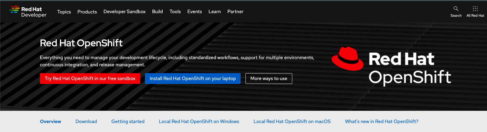
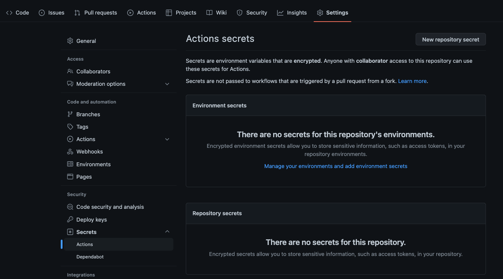
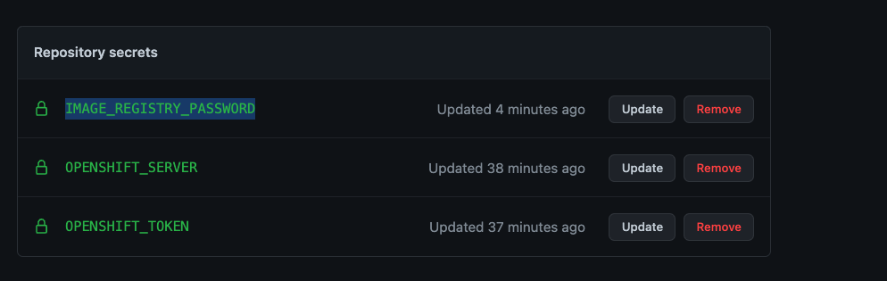
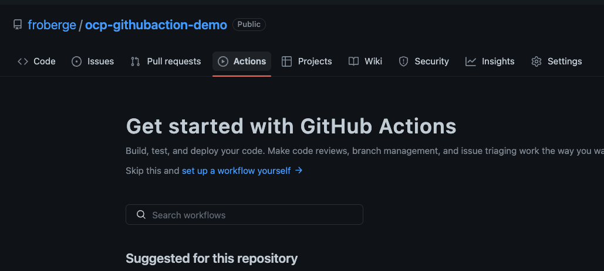
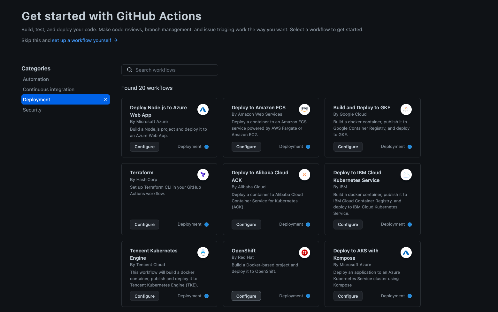
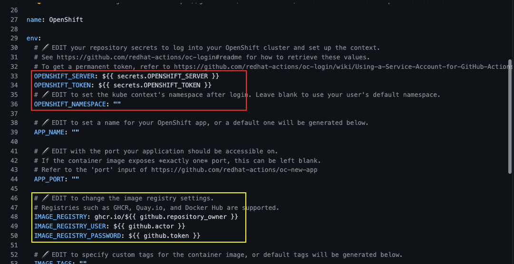
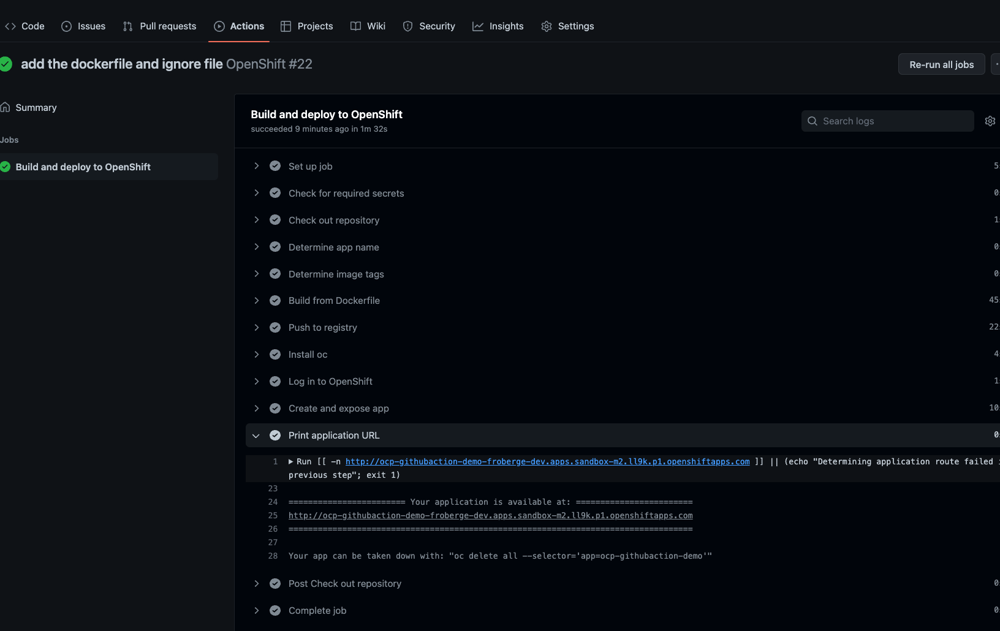
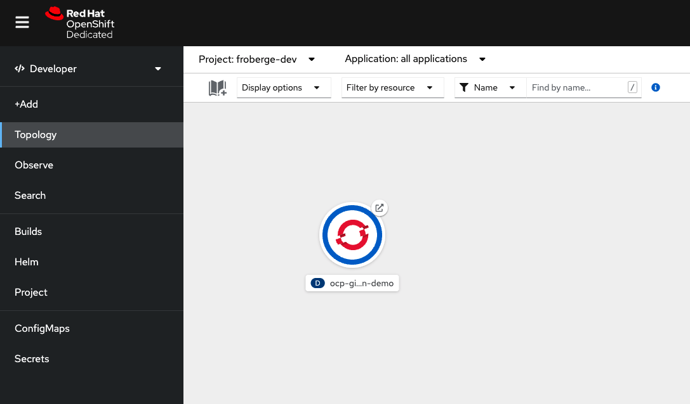

# Introduction to using GitHub Actions with Red Hat OpenShift.

Welcome to the Introduction to using GitHub Actions with OpenShift !! 

## GitHub Action
[GitHub Action](https://github.com/features/actions), automate, customize and execute your software development workflows right in your repository. You can discover, create and share actions to perform any job you'd like, including CI/CD and combine theses actions in a completely customized workflow.


## Overview

In this demo we will walk you through how use `GitHub Actions` to push code to `Red Hat OpenShift`. We will look at bacis concepts and how to create a simple workflows as well as customize a GitHub Actions Workflows using different component from the [Red Hat GitHub Action Page](https://github.com/redhat-actions).

The turotial is divided in different section:

* [Deploying to OpenShift using OpenSift GitHub Action starter flow]()
* [Deploying to OpenShidt using GitHub Actions using custom flow]()


### Prerequisites

* Any Openshift cluster 4.x.
* OpenShift CLI `oc` install and connected to your cluster
* Access to [GitHub](https://github.com)
* A [clone/fork](https://github.com/froberge/ocp-githubaction-demo) of this repository on your GitHub account
* Access to [Quay.io](https://quay.io/)


### OpenShift Cluster
For those who don't have and access to an OpenShift cluster we can use the free [Red Hat OpenShift Sandbox](https://developers.redhat.com/products/openshift/overview). 
. If you don't have one I encourage you to use it. 

:raising_hand: This is what we will you for this demo. 


###### Setup github secret

We need to create 3 secrets in the repository for the workflow to use.

1. The registry repository secret
2. The OpenShift server location
3. The OpenShift Token

* In the repository go to `Settings -> Secrets -> Actions `

* Select New repository secret to create the first secret.
    * Enter the name: `IMAGE_REGISTRY_PASSWORD`
    * Enter the value:  The token value for quay.io

* Enter another repository secret
    * Enter the name: `OPENSHIFT_SERVER`
    * Enter the value:
        * The cluster url retrieved with the OpenShift CLI.
            ```
            oc whoami --show-server
            ```
* Enter another repository secret
    * Enter the name: `OPENSHIFT_TOKEN`
    * Enter the value:  :warning: __This is a temporary token__
        * Enter the token retrieved with the OpenShift CLI.
            ```
            oc whoami --show-token
            ```
    :zap:Create a service account in orther to have a more permenent solutions. [Follow this link](https://github.com/redhat-actions/oc-login/wiki/Using-a-Service-Account-for-GitHub-Actions) to know how. Use that token instead.

    :clipboard: Make sure you have the permission on the user.
    >oc policy add-role-to-user edit system:serviceaccount:[NAMESPACE]:[SERVICE_ACCOUNT]

   
 
#### Setup the GitHub Action.

1. Access GitHub.com in the proper repository and go in to the Actions tab.


1. Scroll down to the deployment section and select `OpenShift`. 


1. Click on `Configure` to edit the yaml



###### Setup the image registry
:warning: for the image registry access I use a Robot that I have created in quay.io instead of my own username/password.

* OPENSHIFT_NAMESPACE: Enter the namespace to use.
* IMAGE_REGISTRY: enter your quay.io repository
* IMAGE_REGISTRY_USER: enter the robot login name
* IMAGE_REGISTRY_PASSWORD: replace by a secret value ${{ secrets.IMAGE_REGISTRY_PASSWORD }} ```

* Click `Start commit`


* The pipeline should start executing and you can check it executing.


:eyeglasses: You can access the application by clicking on the link highlighted above.

You should now see your apps in OpenShift


---


